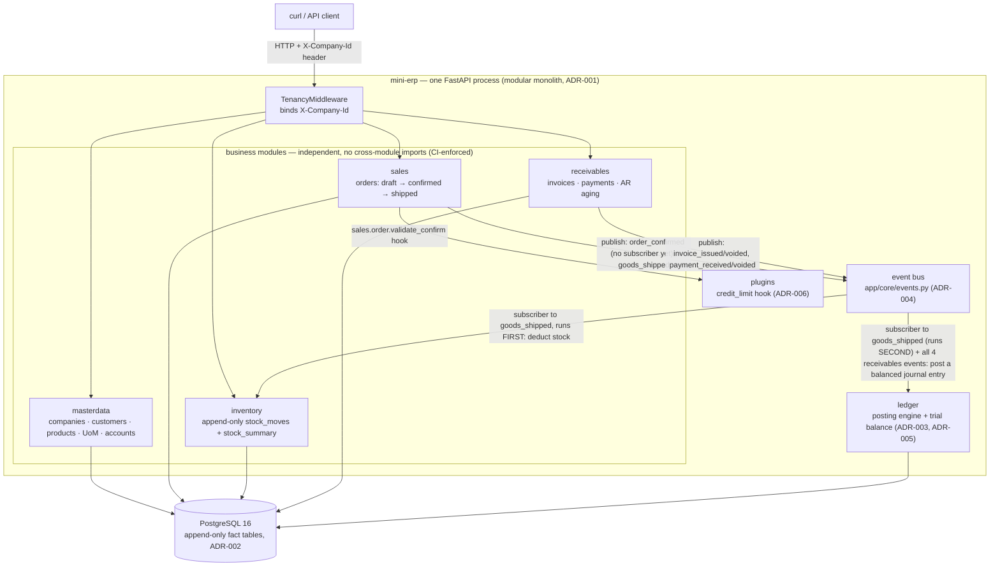

# mini-erp

> Not a Digiwin with more features — the Digiwin Taiwanese SMEs can
> self-host, extend by writing a plugin instead of buying consultant
> hours, and actually trust with their data. Open-source, API-first,
> plugin-extensible ERP kernel.

**This repository state = Phase 1 ("Kernel") complete.** Five business
modules — masterdata, ledger, sales, inventory + shipping, receivables —
implement a full order-to-cash (O2C) line on top of a real double-entry
posting engine, each backed by an [architecture decision
record](docs/adr/README.md); ADR-003 through ADR-008 each passed a real
`codex` CLI consensus review before implementation, and ADR-001/ADR-002
document decisions already made and shipped in Weeks 1-2 (see "Design
Decisions" below for the distinction). See `docs/open-erp-master-plan.md`
for the longer-term plan (Platform → Suites → Taiwan localization) and
`docs/mini-erp-architecture.md` for the original kernel blueprint this
phase implements.

## Non-Goals (Phase 1)

Out of scope until Phase 2+: a plugin **loader** (Phase 1 ships one
hard-wired demonstration plugin — `app/plugins/credit_limit.py` — not a
dynamic loading mechanism), workflow/approval engine, RBAC (today's
`X-Company-Id` header is a deliberate, documented stand-in for a verified
JWT/session claim a real auth layer will set later — see "Multi-tenancy"
below), user-defined custom fields UI (the `custom_data JSONB` column
exists on every primary business entity — companies, customers, products,
accounts, orders, invoices, payments, journal entries, accounting periods
— as the underlying mechanism, though not on line/fact-level tables like
order lines, journal lines, or stock moves; there is also no admin UI or
central field-definition table yet), and any frontend
(this is an API-only kernel — `/docs` is the interactive client for now).
Taiwan-specific tax/e-invoice integration is Phase 4.

## Tech stack

Python 3.12 · FastAPI · SQLAlchemy 2.0 (async, asyncpg) · Pydantic v2 ·
PostgreSQL 16 · Alembic · [uv](https://docs.astral.sh/uv/) for packaging ·
[Hypothesis](https://hypothesis.readthedocs.io/) for property-based
testing.

## Quick start

### Docker Compose

```bash
cp .env.example .env
make up      # docker compose up, blocks until /health responds
make seed    # populate a realistic demo dataset (idempotent — safe to rerun)
make demo    # walk one order through the LIVE REST API, print the resulting trial balance
```

`make demo`'s output looks like this (see "Try it" below for the same
flow as raw `curl`):

```
Order SO-2026-000001: shipped, total 300.000000
Invoice INV-2026-000001: open, total 300.000000
Payment received and fully allocated.

Trial balance:
  code   account                             debit           credit
  1000   Cash                           300.000000         0.000000
  1100   Accounts Receivable            300.000000       300.000000
  1300   Inventory                        0.000000        90.000000
  4000   Revenue                          0.000000       300.000000
  5000   COGS                            90.000000         0.000000
         TOTAL                          690.000000       690.000000
```

Other Makefile targets: `make down` (stop), `make clean` (stop + drop the
volume), `make test` (`pytest` inside your own environment), `make check`
(the exact `ruff check` → `ruff format --check` → `mypy` → `lint-imports`
→ `pytest` sequence CI runs).

### Running on your host (no Docker)

```bash
uv sync --group dev
cp .env.example .env   # edit DATABASE_URL to point at your own Postgres
uv run alembic upgrade head
uv run uvicorn app.main:app --reload
```

`uv run python -m app.cli.seed_demo` and
`DEMO_BASE_URL=http://127.0.0.1:8000 uv run python -m app.cli.demo_o2c`
are the direct equivalents of `make seed`/`make demo` for this path — see
the Makefile for exactly why `seed` talks to the database directly while
`demo` is a real HTTP client against a running server.

## Architecture



Every arrow into a *tenant-scoped* operation crosses the
`X-Company-Id`-bound tenancy filter (see "Multi-tenancy" below) before
any query runs — currency/UoM reference data is the one exception
(global, not company-owned; see the `curl` walkthrough below). `sales`
publishes `order_confirmed` too, but it currently has no subscriber at
all (ADR-006 Decision 4) — registered so `publish()`/replay still
validate its schema and it still gets an outbox row, but nothing reacts
to "confirmed" on its own; the ledger/inventory reaction happens
downstream, at `ship`. `goods_shipped` is the interesting one: the event
bus dispatches it to **two** subscribers in the SAME transaction, and
**their order is normative, not incidental** (ADR-007 Decision 1) —
`inventory` (deducts stock) runs before `ledger.posting` (posts Dr COGS
/ Cr Inventory), "move the goods, then account for them"; either order
would still commit or roll back atomically together, but the ordering
determines which handler's exception is attributed as the failure
reason on a bad `ship`. Full O2C flow: order confirm → ship (posts
COGS/Inventory, deducts stock) → `receivables` invoice (posts
AR/Revenue) → payment (posts Cash/AR) → allocation (subledger-only,
posts nothing) — proved end to end by
`tests/e2e/test_o2c_end_to_end.py` and, for Hypothesis-generated (bounded,
not literally unbounded) legal operation sequences,
`tests/e2e/test_property_o2c_balances.py`.

## Try it: the O2C flow as `curl`

Real output from a freshly-migrated database (redact/replace the UUIDs
with whatever your own run produces):

```bash
BASE=http://localhost:8000/api/v1

# Reference data (global, not tenant-scoped) — seed once.
curl -s -X POST $BASE/currencies -H 'Content-Type: application/json' \
  -d '{"code":"TWD","name":"New Taiwan Dollar","decimal_places":0}'
# {"code":"TWD","name":"New Taiwan Dollar","decimal_places":0,"is_active":true}

UOM_ID=$(curl -s -X POST $BASE/uom -H 'Content-Type: application/json' \
  -d '{"code":"EA","name":"Each"}' \
  | python3 -c 'import sys,json;print(json.load(sys.stdin)["id"])')
# real response shape: {"id":"fff448b2-...","code":"EA","name":"Each","is_active":true}

# Every tenant-scoped call below needs X-Company-Id — no company_id field
# in any request body (see "Multi-tenancy").
COMPANY_ID=$(curl -s -X POST $BASE/companies -H 'Content-Type: application/json' \
  -d '{"code":"ACME","name":"Acme Corp","functional_currency_code":"TWD"}' \
  | python3 -c 'import sys,json;print(json.load(sys.stdin)["id"])')
H="-H X-Company-Id:$COMPANY_ID -H Content-Type:application/json"

curl -s -X POST $BASE/periods $H -d '{"year":2026,"month":8}' > /dev/null
for row in 1000:Cash:asset 1100:"Accounts Receivable":asset 1300:Inventory:asset \
           4000:Revenue:revenue 5000:COGS:expense; do
  IFS=: read -r code name type <<< "$row"
  curl -s -X POST $BASE/accounts $H -d "{\"code\":\"$code\",\"name\":\"$name\",\"type\":\"$type\"}" > /dev/null
done

CUSTOMER_ID=$(curl -s -X POST $BASE/customers $H \
  -d '{"code":"CUST-001","name":"Test Customer","currency_code":"TWD","credit_limit":"50000"}' \
  | python3 -c 'import sys,json;print(json.load(sys.stdin)["id"])')

PRODUCT_ID=$(curl -s -X POST $BASE/products $H \
  -d "{\"sku\":\"WIDGET-1\",\"name\":\"Widget\",\"uom_id\":\"$UOM_ID\",\"list_price\":\"100\",\"standard_cost\":\"30\"}" \
  | python3 -c 'import sys,json;print(json.load(sys.stdin)["id"])')

curl -s -X POST $BASE/inventory/adjustments $H \
  -d "{\"product_id\":\"$PRODUCT_ID\",\"qty_delta\":\"10\",\"reason\":\"initial stock\"}" > /dev/null

# --- the actual O2C line ---

ORDER_ID=$(curl -s -X POST $BASE/sales-orders $H \
  -d "{\"customer_id\":\"$CUSTOMER_ID\",\"lines\":[{\"product_id\":\"$PRODUCT_ID\",\"qty\":\"2\",\"unit_price\":\"100\"}]}" \
  | python3 -c 'import sys,json;print(json.load(sys.stdin)["id"])')

curl -s -X POST $BASE/sales-orders/$ORDER_ID/confirm $H > /dev/null
curl -s -X POST $BASE/sales-orders/$ORDER_ID/ship $H
# {"...","status":"shipped","total":"200.000000",...}  — posts Dr 5000 COGS 60 / Cr 1300 Inventory 60

INVOICE_ID=$(curl -s -X POST $BASE/receivables/invoices $H -d "{\"order_id\":\"$ORDER_ID\"}" \
  | python3 -c 'import sys,json;print(json.load(sys.stdin)["id"])')
# posts Dr 1100 AR 200 / Cr 4000 Revenue 200

PAYMENT_ID=$(curl -s -X POST $BASE/receivables/payments $H \
  -d '{"customer_id":"'"$CUSTOMER_ID"'","external_ref":"PAY-001","amount":"200"}' \
  | python3 -c 'import sys,json;print(json.load(sys.stdin)["id"])')
# posts Dr 1000 Cash 200 / Cr 1100 AR 200

curl -s -X POST $BASE/receivables/payments/$PAYMENT_ID/allocations $H \
  -d "{\"request_ref\":\"ALLOC-001\",\"allocations\":[{\"invoice_id\":\"$INVOICE_ID\",\"amount\":\"200\"}]}" \
  > /dev/null
# subledger-only bookkeeping (ADR-008 Decision 2) — posts nothing

curl -s $BASE/reports/trial-balance $H
```

```json
[
  {"account_code":"1000","account_name":"Cash","total_debit":"200.000000","total_credit":"0.000000"},
  {"account_code":"1100","account_name":"Accounts Receivable","total_debit":"200.000000","total_credit":"200.000000"},
  {"account_code":"1300","account_name":"Inventory","total_debit":"0.000000","total_credit":"60.000000"},
  {"account_code":"4000","account_name":"Revenue","total_debit":"0.000000","total_credit":"200.000000"},
  {"account_code":"5000","account_name":"COGS","total_debit":"60.000000","total_credit":"0.000000"}
]
```

Σdebit = Σcredit = 460 — the double-entry invariant every posting in this
project holds, proved for many Hypothesis-generated legal O2C sequences
(not just this one) by `tests/e2e/test_property_o2c_balances.py`.

## Testing

```bash
uv sync --group dev
uv run pytest -v
```

Tests run against **real PostgreSQL, never SQLite/mocks**. `tests/conftest.py`
picks the backend automatically: `testcontainers.postgres.PostgresContainer`
(a throwaway `postgres:16-alpine` container) if Docker is reachable —
this is what CI and most contributor machines use — otherwise an
embedded [`pgserver`](https://pypi.org/project/pgserver/) binary, still
real Postgres, just without a container runtime. Either path runs
`alembic upgrade head` against the ephemeral database first
(`tests/test_migrations.py` also asserts the resulting schema
explicitly), then truncates tenant-scoped tables between tests while
keeping seeded reference data (currencies/UoM) for the whole session.

Beyond ordinary CRUD/integration tests per module:

- **Cross-company isolation** (`tests/*/test_cross_company_isolation.py`):
  for every tenant-scoped endpoint, company A creates a resource and
  company B is proven unable to read/update/delete it (404) or see it in
  a list, plus a DB-layer test that the ORM filter itself fail-closes
  (raises) when no company context is bound.
- **Full O2C end-to-end** (`tests/e2e/test_o2c_end_to_end.py`): create →
  confirm → ship → invoice → pay → allocate against a real Postgres, with
  the exact ledger delta asserted at every single step (not just a final
  "it balances" check — a step posting the right amount to the wrong
  account, or vice versa, fails loudly).
- **Property-based invariants**
  (`tests/ledger/test_property_trial_balance.py`,
  `tests/e2e/test_property_o2c_balances.py`): Hypothesis-generated random
  (but always-legal, bounded-length) operation sequences, asserting the
  trial balance balances, the AR ↔ ledger 1100 control-account tie-out
  holds, and `on_hand >= 0` — not just for the one flow the E2E test
  walks, but for many legal interleavings of
  orders/shipments/invoices/payments.
- **Idempotent CLIs** (`tests/e2e/test_seed_idempotent.py`): `seed_demo`
  run twice against a real DB produces unchanged row counts, stock, and
  balances.

## Design Decisions

Every non-trivial decision below is written up as a full ADR under
[`docs/adr/`](docs/adr/README.md); ADR-003 through ADR-008 each passed a
real `codex` CLI architecture-consensus review *before* implementation
(not a self-review — see each ADR's "Consensus Revisions" section for
the finding-by-finding record). This section is a map, not a
substitute — follow the links for the actual reasoning.

| Topic | ADR |
|---|---|
| Modular monolith, not microservices | [ADR-001](docs/adr/ADR-001-modular-monolith.md) |
| Append-only fact tables + rebuildable summaries | [ADR-002](docs/adr/ADR-002-append-only-ledgers.md) |
| Posting engine (events → balanced journal entries) | [ADR-003](docs/adr/ADR-003-posting-engine.md) |
| Event bus | [ADR-004](docs/adr/ADR-004-event-bus.md) |
| Ledger/journal design | [ADR-005](docs/adr/ADR-005-ledger-journal-design.md) |
| Sales module, hook registry | [ADR-006](docs/adr/ADR-006-sales-and-hook-registry.md) |
| Inventory, shipping | [ADR-007](docs/adr/ADR-007-inventory-and-shipping.md) |
| Receivables — invoicing, payments, AR aging | [ADR-008](docs/adr/ADR-008-receivables.md) |

A few cross-cutting decisions that don't have their own numbered ADR but
matter to anyone reading the code:

**Multi-tenancy.** `app/core/tenancy.py` holds the active company id in a
`contextvars.ContextVar`, bound per-request by `TenancyMiddleware`
(`app/main.py`) from a trusted `X-Company-Id` header. `app/core/db.py`
registers a SQLAlchemy `do_orm_execute` hook that injects
`with_loader_criteria` filtering to the active company for every ORM
**`SELECT`** touching a tenant-scoped table (it returns immediately for
any non-`SELECT` statement — writes are a separate mechanism, below), and
**raises if no context is bound** rather than silently returning zero or
all rows — fail-closed, not fail-open. This is why cross-company
`GET`/`PATCH`/`DELETE` by id resolve to `404`: every service function
that mutates a row by id fetches it first via exactly this
hook-filtered `SELECT` (e.g. `receivables.service.get_invoice`), so the
row is invisible before any write is even attempted — "belongs to
another company" and "doesn't exist" are indistinguishable by design.
Writes themselves are protected by convention, not this hook: every
`INSERT` stamps `company_id` from `require_current_company_id()`, never
from client input — `*Create` schemas have no `company_id` field at all,
so nothing can be smuggled into a request body even today. Phase 1 has
no auth/RBAC (Phase 2), so the header is a deliberate, documented
stand-in for a verified JWT/session claim.

**Money.** Every monetary column is `NUMERIC(20, 6)`; `exchange_rates.rate`
is `NUMERIC(20, 10)` with a `rate_date` (Phase 1 is TWD-only in practice —
`masterdata.schemas.CustomerCreate`/`CompanyCreate` enforce it — but the
multi-currency schema is already in place for Phase 3). Journal line
amounts (`ledger.schemas`) and receivables payment/allocation amounts
(`receivables.schemas`) are round-half-even at the Pydantic schema layer,
not left to implicit DB coercion — the two places a rounding choice
actually feeds an accounting invariant. Other Decimal fields (e.g.
`Product.list_price`/`standard_cost`) are `NUMERIC(20,6)`-typed but not
yet explicitly quantized at the schema layer; a future pass should make
that consistent everywhere the invariant matters.

**Ledger.** Double-entry, dual-currency lines, a `DEFERRED CONSTRAINT
TRIGGER` that rejects an unbalanced entry at commit, immutability via
`BEFORE UPDATE OR DELETE` triggers (corrections are reversal-only), and
gapless entry numbering under row-level locking. The trial balance is
always computed on the fly from `journal_lines` — there is no
maintained balance column on `accounts` (see ADR-002 for why that's a
deliberate per-domain choice, not an inconsistency with
`stock_summary`/`invoices.settled_amount`, which *are* maintained).

**Event bus.** `app/core/events.py` is synchronous and in-process:
`publish()` validates the payload against a registered schema, writes one
row to `outbox` in the caller's own transaction, then calls every
subscribed handler inline — a handler exception aborts the whole
transaction. Not every registered event has a subscriber:
`sales.order_confirmed` is registered (so `publish()`/replay still
validate its schema and it still gets an outbox row) but deliberately has
none (ADR-006 Decision 4) — nothing reacts to "confirmed" on its own.
`app/modules/ledger/posting.py` subscribes to `sales.goods_shipped` and
all four `receivables.*` events, turning each into a balanced journal
entry via a declarative rules table.
`app/modules/inventory/service.py`'s `handle_goods_shipped` ALSO
subscribes to `sales.goods_shipped`, to deduct stock — `goods_shipped` is
the only currently-registered event with two subscribers (every
`receivables.*` event has just the one, `ledger.posting`), and for it,
**subscription order is normative, not incidental** (ADR-007 Decision 1):
inventory's deduction handler runs before ledger's posting handler,
"move the goods, then account for them". Both still run inside the same
transaction as
the publish, so either order commits or rolls back atomically together;
the ordering only affects which handler's exception is attributed as the
failure reason on a bad `ship`. `app.cli.replay_outbox` re-dispatches any
`outbox` row still `dispatched_at IS NULL` directly to its handler(s).

**Plugins.** In-process, no sandbox — same trust model as Odoo (see
`SECURITY.md`): a plugin is code an administrator chose to install, not
untrusted third-party input. `app/plugins/credit_limit.py` is Phase 1's
one demonstration plugin, vetoing `sales.confirm_order` via the
`sales.order.validate_confirm` hook when a customer's exposure (open
invoices + uninvoiced confirmed orders) would exceed their credit limit
(`credit_limit == 0` means "do not check"). A real plugin *loader*
(dynamic discovery/registration) is Phase 2 scope.

## Project layout

```
app/
├── core/            # settings, async DB session mgmt, tenancy context/filter,
│                     # event bus, hook registry, exceptions, advisory locking
├── modules/
│   ├── masterdata/   # companies, customers, products, UoM, accounts, currencies
│   ├── ledger/       # journal entries, accounting periods, trial balance, posting engine
│   ├── sales/        # orders: draft → confirmed → shipped, hook registry consumer
│   ├── inventory/    # stock_moves (append-only) + stock_summary, goods_shipped subscriber
│   └── receivables/  # invoices, payments, allocations, AR aging
├── plugins/          # credit_limit.py — the one hard-wired demonstration plugin
├── cli/              # seed_demo, demo_o2c, replay_outbox, rebuild_ar_balances, rebuild_stock_summary
└── main.py           # FastAPI app, tenancy middleware, exception handlers, router mounting
alembic/               # async migrations; single source of truth is app.core.settings
docs/
├── adr/               # architecture decision records, incl. WEEK7-phase1-hardening-brief.md
│                       # (see the Design Decisions table above)
├── open-erp-master-plan.md
└── mini-erp-architecture.md
tests/
├── conftest.py        # real-Postgres fixtures (testcontainers, or pgserver fallback)
├── e2e/                # full O2C flow, property-based invariants, idempotent-seed tests
└── <module>/           # CRUD + cross-company isolation integration tests, one dir per module
```

## Engineering quality gates (CI)

`ruff check` (lint) → `ruff format --check` → `mypy` → `import-linter`
(module independence contracts — business modules may not import each
other's `models`/`service`, core may not import business modules or
plugins) → `pytest` against a real Postgres service container. Same
sequence as `make check`. See `.github/workflows/ci.yml`.

## License

Apache-2.0 (see `LICENSE`) — chosen for enterprise adoption friendliness.
