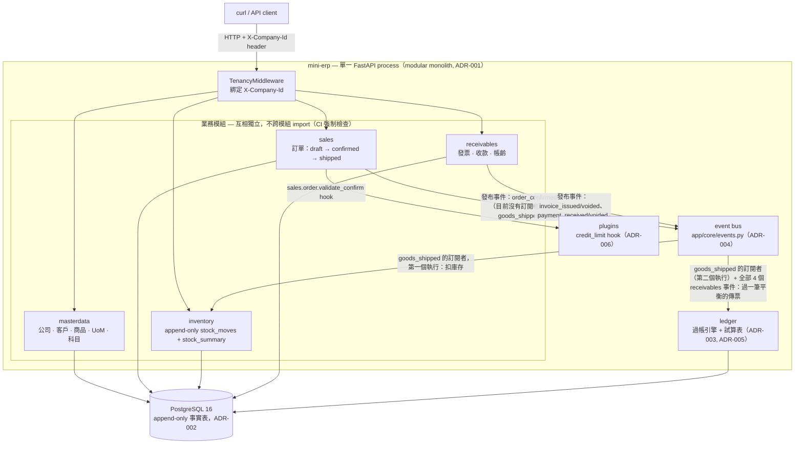

# mini-erp

[English](README.md) | 繁體中文


> 不是「功能更多的鼎新」——而是讓台灣中小企業能夠自架、能用寫 plugin
> 取代購買顧問工時來客製、而且真正能信任自己資料的鼎新。開源、
> API-first、可用 plugin 擴充的 ERP 核心。

**目前這個 repo 的狀態 = Phase 1（「Kernel」）已完成。** 五個業務模組
——masterdata、ledger、sales、inventory + shipping、receivables——
在一個真正的複式簿記過帳引擎（posting engine）之上，實作了完整的
order-to-cash（O2C，訂單到收款）流程；每一個模組都有對應的
[架構決策紀錄（ADR）](docs/adr/README.md)——ADR-003 到 ADR-008 在實作
之前都經過真正的 `codex` CLI 共識審查（consensus review），ADR-001/
ADR-002 記錄的則是 Week 1-2 就已經拍板並上線的決策（兩者的差別見下方
「設計決策」段落）。更長期的規劃（Platform → Suites →
台灣本地化）見 `docs/open-erp-master-plan.md`，這個 Phase 所實作的原始
kernel 藍圖見 `docs/mini-erp-architecture.md`。

## Phase 1 的 Non-Goals（刻意不做的事）

Phase 2 以後才會做：plugin **loader**（Phase 1 只硬寫死一個示範用的
plugin ——`app/plugins/credit_limit.py`——不是動態載入機制）、
workflow/審批引擎、RBAC（現在的 `X-Company-Id` header 是刻意、有記錄
在案的權宜設計，代替未來真正 auth 層會設定的、經過驗證的 JWT/session
claim——見下方「多租戶（Multi-tenancy）」）、使用者自訂欄位的管理介面
（`custom_data JSONB` 欄位已經存在於每個主要業務實體——公司、客戶、
商品、科目、訂單、發票、付款、傳票、會計期間——是這個機制的底層基礎，
但 line/fact 層級的表（訂單明細、傳票明細、庫存異動）還沒有；也還沒有
管理介面或中央欄位定義表）、以及任何前端（這是一個純 API 的 kernel
——現階段 `/docs` 就是互動式的 client）。台灣特有的稅務/電子發票整合是
Phase 4 的事。

## 技術棧

Python 3.12 · FastAPI · SQLAlchemy 2.0（async, asyncpg）· Pydantic v2 ·
PostgreSQL 16 · Alembic · [uv](https://docs.astral.sh/uv/) 做套件管理 ·
[Hypothesis](https://hypothesis.readthedocs.io/) 做 property-based
testing。

## 快速開始

### Docker Compose

```bash
cp .env.example .env
make up      # docker compose up，會擋著直到 /health 回應
make seed    # 灌一份真實感的展示資料（冪等——重跑也安全）
make demo    # 讓一張訂單真的走完 REST API 的完整流程，印出結果試算表
```

`make demo` 的輸出長這樣（下方「實際試試看」有同一條流程改用原生
`curl` 跑的版本）：

```
Order SO-2026-000001: shipped, total 300.000000
Invoice INV-2026-000001: open, total 300.000000
Payment received and fully allocated.

Trial balance:
  code   account                             debit           credit
  1000   Cash                           300.000000         0.000000
  1100   Accounts Receivable            300.000000       300.000000
  1300   Inventory                        0.000000        90.000000
  4000   Revenue                          0.000000       300.000000
  5000   COGS                            90.000000         0.000000
         TOTAL                          690.000000       690.000000
```

其他 Makefile 指令：`make down`（停止）、`make clean`（停止並清掉
volume）、`make test`（在你自己的環境裡跑 `pytest`）、`make check`
（跟 CI 跑的完全一樣的 `ruff check` → `ruff format --check` → `mypy`
→ `lint-imports` → `pytest` 那串流程）。

### 直接在本機跑（不用 Docker）

```bash
uv sync --group dev
cp .env.example .env   # 把 DATABASE_URL 改成指向你自己的 Postgres
uv run alembic upgrade head
uv run uvicorn app.main:app --reload
```

`uv run python -m app.cli.seed_demo` 和
`DEMO_BASE_URL=http://127.0.0.1:8000 uv run python -m app.cli.demo_o2c`
是這個路徑下 `make seed`/`make demo` 的直接對應版本——`seed` 為什麼是
直接跟資料庫對話、`demo` 為什麼是對著一個真的正在跑的 server 發送
HTTP 請求，確切原因看 Makefile。

## 架構



每一個進入*租戶範圍（tenant-scoped）*操作的箭頭，在任何查詢真正執行
之前都會先經過綁定 `X-Company-Id` 的租戶過濾（見下方「多租戶」）——
唯一的例外是幣別/UoM 這類參考資料（全域共用、不屬於任何一家公司；見
下方的 `curl` 實作流程）。`sales` 也會發布 `order_confirmed`，但目前
完全沒有訂閱者（ADR-006 Decision 4）——之所以還是要註冊，是為了讓
`publish()`/replay 依然能驗證它的 schema、依然會產生一筆 outbox
紀錄，但「confirmed」這件事本身目前不會觸發任何反應；真正的
ledger/inventory 反應發生在下游的 `ship` 動作。`goods_shipped`
比較特別：event bus 會在**同一個交易**內把它分派給**兩個**訂閱者，而且
**訂閱順序是規範性的、不是隨意的**（ADR-007 Decision 1）——
`inventory`（扣庫存）會先於 `ledger.posting`（過 Dr COGS / Cr
Inventory）執行，「先搬貨、再記帳」；不管順序為何，兩者都還是會一起
commit 或一起 rollback，但順序決定了 `ship` 失敗時，是哪個 handler
的例外被歸咎為失敗原因。完整的 O2C 流程：訂單確認 → 出貨（過
COGS/Inventory、扣庫存）→ `receivables` 開發票（過 AR/Revenue）→
收款（過 Cash/AR）→ 沖款（只動明細帳，不過帳）——完整流程由
`tests/e2e/test_o2c_end_to_end.py` 端到端證實，而在 Hypothesis 產生的
（有邊界、非真正無限）合法操作序列上，則由
`tests/e2e/test_property_o2c_balances.py` 證實。

## 實際試試看：用 `curl` 走一遍 O2C 流程

以下是對一個剛 migrate 完的資料庫的真實輸出（把 UUID 換成你自己跑出來
的值）：

```bash
BASE=http://localhost:8000/api/v1

# 參考資料（全域、不分租戶）——只需要 seed 一次。
curl -s -X POST $BASE/currencies -H 'Content-Type: application/json' \
  -d '{"code":"TWD","name":"New Taiwan Dollar","decimal_places":0}'
# {"code":"TWD","name":"New Taiwan Dollar","decimal_places":0,"is_active":true}

UOM_ID=$(curl -s -X POST $BASE/uom -H 'Content-Type: application/json' \
  -d '{"code":"EA","name":"Each"}' \
  | python3 -c 'import sys,json;print(json.load(sys.stdin)["id"])')
# 真實的回應格式：{"id":"fff448b2-...","code":"EA","name":"Each","is_active":true}

# 下面每一個租戶範圍內的呼叫都需要 X-Company-Id——任何 request body
# 裡都不會有 company_id 欄位（見「多租戶」）。
COMPANY_ID=$(curl -s -X POST $BASE/companies -H 'Content-Type: application/json' \
  -d '{"code":"ACME","name":"Acme Corp","functional_currency_code":"TWD"}' \
  | python3 -c 'import sys,json;print(json.load(sys.stdin)["id"])')
H="-H X-Company-Id:$COMPANY_ID -H Content-Type:application/json"

curl -s -X POST $BASE/periods $H -d '{"year":2026,"month":8}' > /dev/null
for row in 1000:Cash:asset 1100:"Accounts Receivable":asset 1300:Inventory:asset \
           4000:Revenue:revenue 5000:COGS:expense; do
  IFS=: read -r code name type <<< "$row"
  curl -s -X POST $BASE/accounts $H -d "{\"code\":\"$code\",\"name\":\"$name\",\"type\":\"$type\"}" > /dev/null
done

CUSTOMER_ID=$(curl -s -X POST $BASE/customers $H \
  -d '{"code":"CUST-001","name":"Test Customer","currency_code":"TWD","credit_limit":"50000"}' \
  | python3 -c 'import sys,json;print(json.load(sys.stdin)["id"])')

PRODUCT_ID=$(curl -s -X POST $BASE/products $H \
  -d "{\"sku\":\"WIDGET-1\",\"name\":\"Widget\",\"uom_id\":\"$UOM_ID\",\"list_price\":\"100\",\"standard_cost\":\"30\"}" \
  | python3 -c 'import sys,json;print(json.load(sys.stdin)["id"])')

curl -s -X POST $BASE/inventory/adjustments $H \
  -d "{\"product_id\":\"$PRODUCT_ID\",\"qty_delta\":\"10\",\"reason\":\"initial stock\"}" > /dev/null

# --- 真正的 O2C 那條線 ---

ORDER_ID=$(curl -s -X POST $BASE/sales-orders $H \
  -d "{\"customer_id\":\"$CUSTOMER_ID\",\"lines\":[{\"product_id\":\"$PRODUCT_ID\",\"qty\":\"2\",\"unit_price\":\"100\"}]}" \
  | python3 -c 'import sys,json;print(json.load(sys.stdin)["id"])')

curl -s -X POST $BASE/sales-orders/$ORDER_ID/confirm $H > /dev/null
curl -s -X POST $BASE/sales-orders/$ORDER_ID/ship $H
# {"...","status":"shipped","total":"200.000000",...}  — 過 Dr 5000 COGS 60 / Cr 1300 Inventory 60

INVOICE_ID=$(curl -s -X POST $BASE/receivables/invoices $H -d "{\"order_id\":\"$ORDER_ID\"}" \
  | python3 -c 'import sys,json;print(json.load(sys.stdin)["id"])')
# 過 Dr 1100 AR 200 / Cr 4000 Revenue 200

PAYMENT_ID=$(curl -s -X POST $BASE/receivables/payments $H \
  -d '{"customer_id":"'"$CUSTOMER_ID"'","external_ref":"PAY-001","amount":"200"}' \
  | python3 -c 'import sys,json;print(json.load(sys.stdin)["id"])')
# 過 Dr 1000 Cash 200 / Cr 1100 AR 200

curl -s -X POST $BASE/receivables/payments/$PAYMENT_ID/allocations $H \
  -d "{\"request_ref\":\"ALLOC-001\",\"allocations\":[{\"invoice_id\":\"$INVOICE_ID\",\"amount\":\"200\"}]}" \
  > /dev/null
# 只是明細帳層級的沖款記錄（ADR-008 Decision 2）——不過任何傳票

curl -s $BASE/reports/trial-balance $H
```

```json
[
  {"account_id":"90a4baa0-...","account_code":"1000","account_name":"Cash","account_type":"ASSET","total_debit":"200.000000","total_credit":"0.000000"},
  {"account_id":"c5cf3413-...","account_code":"1100","account_name":"Accounts Receivable","account_type":"ASSET","total_debit":"200.000000","total_credit":"200.000000"},
  {"account_id":"cee6f514-...","account_code":"1300","account_name":"Inventory","account_type":"ASSET","total_debit":"0.000000","total_credit":"60.000000"},
  {"account_id":"27ae2975-...","account_code":"4000","account_name":"Revenue","account_type":"REVENUE","total_debit":"0.000000","total_credit":"200.000000"},
  {"account_id":"41e3480d-...","account_code":"5000","account_name":"COGS","account_type":"EXPENSE","total_debit":"60.000000","total_credit":"0.000000"}
]
```

Σ借方 = Σ貸方 = 460——這個 project 裡每一筆過帳都遵守的複式簿記
不變量，不只這一條流程，`tests/e2e/test_property_o2c_balances.py`
在許多 Hypothesis 產生的合法 O2C 序列上都證實了這一點。

## 測試

```bash
uv sync --group dev
uv run pytest -v
```

測試一律對著**真正的 PostgreSQL 跑，絕不用 SQLite/mock**。
`tests/conftest.py` 會自動挑後端：有 Docker 可用時用
`testcontainers.postgres.PostgresContainer`（一個用完即丟的
`postgres:16-alpine` 容器）——CI 跟大多數貢獻者的機器都是走這條路——
沒有的話就退回內嵌的 [`pgserver`](https://pypi.org/project/pgserver/)
binary，一樣是真的 Postgres，只是不需要容器執行環境。不管走哪條路，
都會先對這個暫時性的資料庫跑 `alembic upgrade head`（
`tests/test_migrations.py` 也會明確地驗證跑出來的 schema），然後在
測試之間清空租戶範圍的資料表，同一個 session 內保留已經 seed 好的
參考資料（幣別/UoM）。

除了每個模組各自的一般 CRUD/整合測試之外：

- **跨公司隔離**（`tests/*/test_cross_company_isolation.py`）：對每一個
  租戶範圍的 endpoint，證明公司 A 建立的資源，公司 B 完全讀不到/改不到
  /刪不到（回 404）、也不會出現在列表裡，再加上一個 DB 層測試，證明
  沒有綁定公司 context 時，ORM 過濾本身會 fail-closed（直接拋錯）。
- **完整 O2C 端到端**（`tests/e2e/test_o2c_end_to_end.py`）：對著真的
  Postgres 跑一遍 create → confirm → ship → invoice → pay →
  allocate，每一步都斷言精確的傳票異動（不只是最後檢查「有平衡就好」
  ——某一步過錯金額或過錯科目都會馬上大聲失敗）。
- **Property-based 不變量**（`tests/ledger/test_property_trial_balance.py`、
  `tests/e2e/test_property_o2c_balances.py`）：用 Hypothesis 產生隨機
  （但一定合法、長度有界）的操作序列，斷言試算表一定平衡、AR ↔ ledger
  1100 控制科目對得起來、`on_hand >= 0`——不只驗證 E2E 測試走的那一條
  流程，而是驗證訂單/出貨/發票/付款許多種合法交錯順序下都成立。
- **CLI 冪等性**（`tests/e2e/test_seed_idempotent.py`）：`seed_demo`
  對著同一個真實資料庫跑兩次，列數、庫存、餘額都不會變。

## 設計決策

下面每一個非瑣碎的決策都寫成完整的 ADR，放在
[`docs/adr/`](docs/adr/README.md) 下；ADR-003 到 ADR-008 在實作*之前*
都經過真正的 `codex` CLI 架構共識審查（不是自己審自己——每份 ADR 的
「Consensus Revisions」段落都有逐項發現的完整紀錄）。這張表只是地圖、
不是替代品——真正的推理過程請點連結進去看。

| 主題 | ADR |
|---|---|
| Modular monolith，不是 microservices | [ADR-001](docs/adr/ADR-001-modular-monolith.md) |
| Append-only 事實表 + 可重建的彙總表 | [ADR-002](docs/adr/ADR-002-append-only-ledgers.md) |
| 過帳引擎（事件 → 平衡的傳票） | [ADR-003](docs/adr/ADR-003-posting-engine.md) |
| Event bus | [ADR-004](docs/adr/ADR-004-event-bus.md) |
| Ledger/傳票設計 | [ADR-005](docs/adr/ADR-005-ledger-journal-design.md) |
| Sales 模組、hook registry | [ADR-006](docs/adr/ADR-006-sales-and-hook-registry.md) |
| Inventory、出貨 | [ADR-007](docs/adr/ADR-007-inventory-and-shipping.md) |
| Receivables ——開票、收款、帳齡 | [ADR-008](docs/adr/ADR-008-receivables.md) |

還有幾個沒有獨立編號 ADR、但看程式碼的人一定要知道的跨模組決策：

**多租戶（Multi-tenancy）。** `app/core/tenancy.py` 用一個
`contextvars.ContextVar` 保存目前生效的公司 id，由 `TenancyMiddleware`
（`app/main.py`）在每個 request 開始時，從一個受信任的 `X-Company-Id`
header 綁定進去。`app/core/db.py` 註冊了一個 SQLAlchemy 的
`do_orm_execute` hook，對每一個碰到租戶範圍資料表的 ORM
**`SELECT`** 都會注入 `with_loader_criteria` 過濾成目前生效的公司
（對任何非 `SELECT` 的敘述會直接返回不處理——寫入是另外一套機制，見
下方），而且**沒有綁定 context 就直接拋錯**，而不是悄悄回傳零筆或
全部——這是 fail-closed，不是 fail-open。這也是為什麼跨公司的
`GET`/`PATCH`/`DELETE`（用 id 查）結果都是 `404`：每一個用 id
修改資料列的 service function，都會先透過這個被 hook 過濾過的
`SELECT` 把資料撈出來一次（例如 `receivables.service.get_invoice`），
所以在任何寫入動作被嘗試之前，那一列資料根本就是「不可見」的——
「屬於別家公司」跟「根本不存在」在設計上刻意做成無法區分。寫入本身
是靠慣例保護、不是靠這個 hook：每一個 `INSERT` 的 `company_id` 都是
從 `require_current_company_id()` 蓋上去的，絕不會來自 client
輸入——`*Create` 這些 schema 根本沒有 `company_id` 欄位，所以現在就
沒有任何方法能把它偷塞進 request body 裡。Phase 1 沒有 auth/RBAC
（Phase 2 才有），所以這個 header 是刻意、有記錄在案的權宜設計，
代替一個經過驗證的 JWT/session claim。

**金額（Money）。** 每一個金額欄位都是 `NUMERIC(20, 6)`；
`exchange_rates.rate` 是 `NUMERIC(20, 10)` 並帶一個 `rate_date`
（Phase 1 實務上只支援台幣——`masterdata.schemas.CustomerCreate`/
`CompanyCreate` 有強制檢查——但多幣別的 schema 已經為 Phase 3
準備好了）。每個模組的每一個金額欄位，都在 Pydantic schema 層做
round-half-even（銀行家捨入法），不是丟給 DB 隱含轉型：傳票行金額
（`ledger.schemas`）跟應收帳款的收款/沖款金額
（`receivables.schemas`）從 Week 6 或更早就是這樣；
`Customer.credit_limit`、`Product.list_price`/`standard_cost`
（`masterdata.schemas`）、`SalesOrderLineCreate.unit_price`
（`sales.schemas`）則是從 Week 8 Decision 0 開始。每個模組各自擁有
一份私有的 round-half-even 輔助函式（masterdata/sales/receivables
裡叫 `_round_half_even_6dp`；ledger 裡叫
`_round_half_even_to_6dp`）——依照 import-linter 的模組獨立性契約，
從不跨模組 import——而不是共用 `app/core/` 底下的一份。`credit_limit`
/價格/成本欄位的合法值一律包含零（不會被拒絕），這點跟
`receivables.schemas` 的 `_round_and_reject_zero` 不一樣——那個是
專門給收款/沖款金額用的，因為那些情境下零金額本來就不合法。

**Ledger（總帳）。** 複式簿記、雙幣別行項、一個
`DEFERRED CONSTRAINT TRIGGER` 在 commit 時擋下不平衡的傳票、透過
`BEFORE UPDATE OR DELETE` trigger 確保不可變（更正只能用反轉分錄）、
以及在 row-level 鎖定下的無空隙傳票編號。試算表永遠是即時從
`journal_lines` 算出來的——`accounts` 上沒有維護一個餘額欄位（見
ADR-002，說明這是刻意的、逐領域決定的取捨，跟同樣有維護欄位的
`stock_summary`/`invoices.settled_amount` 並不矛盾）。

**Event bus。** `app/core/events.py` 是同步、in-process 的：
`publish()` 會先驗證 payload 符合已註冊的 schema、在呼叫者自己的
交易內寫一列到 `outbox`，然後依序同步呼叫每一個訂閱的 handler——
任何一個 handler 拋出例外都會讓整個交易一起 rollback。不是每一個
已註冊的事件都有訂閱者：`sales.order_confirmed` 有註冊（讓
`publish()`/replay 依然能驗證它的 schema、依然會產生一筆 outbox
紀錄）但刻意沒有任何訂閱者（ADR-006 Decision 4）——沒有任何東西會對
「confirmed」這件事本身有反應。`app/modules/ledger/posting.py`
訂閱了 `sales.goods_shipped` 跟全部 4 個 `receivables.*` 事件，透過一張
宣告式規則表，把每一個都轉成一筆平衡的傳票。
`app/modules/inventory/service.py` 的 `handle_goods_shipped` **也**
訂閱了 `sales.goods_shipped`，用來扣庫存——`goods_shipped` 是目前唯一
有兩個訂閱者的已註冊事件（每一個 `receivables.*` 事件都只有
`ledger.posting` 這一個訂閱者），而對它來說，**訂閱順序是規範性的、
不是隨意的**（ADR-007 Decision 1）：inventory 的扣庫存 handler 會先於
ledger 的過帳 handler 執行，「先搬貨、再記帳」。兩者都在跟 publish
同一個交易裡執行，所以不管順序為何都會一起 commit 或一起
rollback；順序只影響 `ship` 失敗時，是哪個 handler 的例外被歸咎為
失敗原因。`app.cli.replay_outbox` 會把任何 `dispatched_at IS NULL`
的 `outbox` 列，直接重新分派給它的 handler。

**Plugins。** In-process、沒有沙箱——跟 Odoo 一樣的信任模型（見
`SECURITY.md`）：plugin 是管理者自己選擇安裝的程式碼，不是不受信任
的第三方輸入。`app/plugins/credit_limit.py` 是 Phase 1 唯一的示範
plugin，透過 `sales.order.validate_confirm` 這個 hook，在客戶的曝險
（未結案的發票 + 已確認但還沒開發票的訂單）會超過信用額度時，否決
`sales.confirm_order`（`credit_limit == 0` 代表「不檢查」）。真正的
plugin **loader**（動態探索/註冊機制）是 Phase 2 的範疇。

## 專案目錄結構

```
app/
├── core/            # 設定、async DB session 管理、租戶 context/過濾器、
│                     # event bus、hook registry、例外、advisory locking
├── modules/
│   ├── masterdata/   # 公司、客戶、商品、UoM、科目、幣別
│   ├── ledger/       # 傳票、會計期間、試算表、過帳引擎
│   ├── sales/        # 訂單：draft → confirmed → shipped，hook registry 的使用者
│   ├── inventory/    # stock_moves（append-only）+ stock_summary，goods_shipped 的訂閱者
│   └── receivables/  # 發票、收款、沖款、帳齡
├── plugins/          # credit_limit.py ——唯一一個寫死安裝的示範 plugin
├── cli/              # seed_demo、demo_o2c、replay_outbox、rebuild_ar_balances、rebuild_stock_summary
└── main.py           # FastAPI app、租戶 middleware、例外處理、router 掛載
alembic/               # async migration；唯一真實來源是 app.core.settings
docs/
├── adr/               # 架構決策紀錄，含 WEEK7-phase1-hardening-brief.md
│                       # （見上方「設計決策」表）
├── open-erp-master-plan.md
└── mini-erp-architecture.md
tests/
├── conftest.py        # 真 Postgres fixture（testcontainers，或 pgserver 備援）
├── e2e/                # 完整 O2C 流程、property-based 不變量、冪等 seed 測試
└── <module>/           # 每個模組各自的 CRUD + 跨公司隔離整合測試
```

## 工程品質關卡（CI）

`ruff check`（lint）→ `ruff format --check` → `mypy` → `import-linter`
（模組獨立性契約——業務模組之間不能 import 彼此的 `models`/`service`，
core 不能 import 業務模組或 plugins）→ 對著一個真的 Postgres service
container 跑 `pytest`。跟 `make check` 一模一樣的順序。見
`.github/workflows/ci.yml`。

## 授權條款

Apache-2.0（見 `LICENSE`）——選這個是為了對企業採用更友善。
